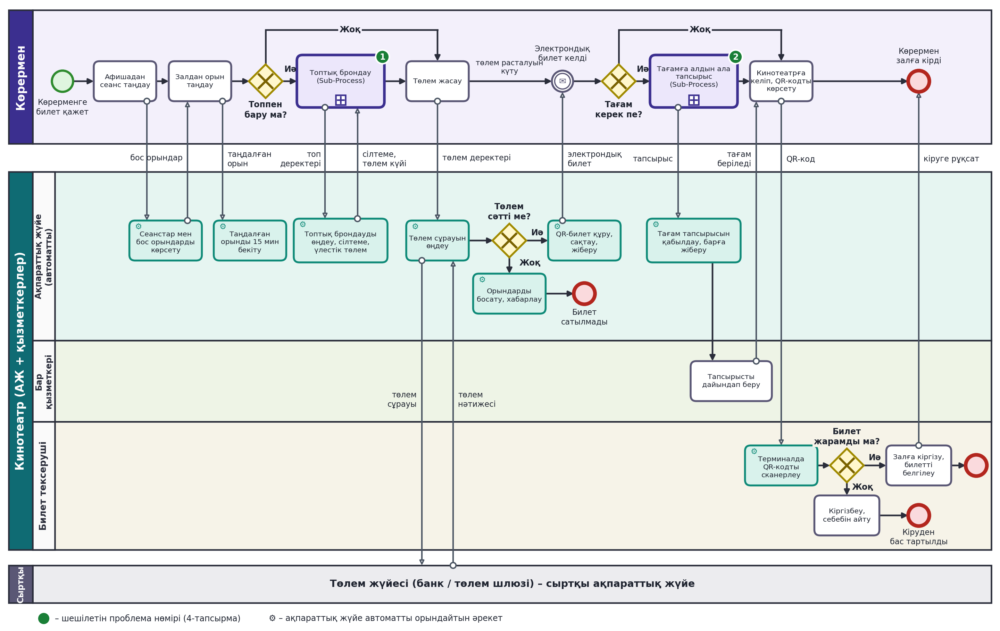
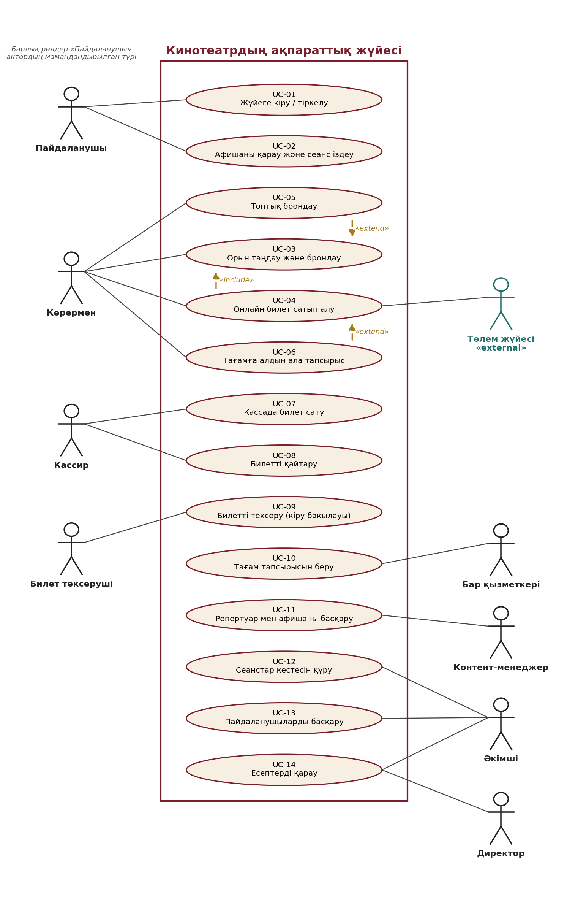

# Кинотеатрдың ақпараттық жүйесі

Жоба № 12 · «Ақпараттық жүйелер» кафедрасы · әл-Фараби атындағы Қазақ ұлттық университеті

Автор: Бақтыбек Сырым · Тексерген: Тусупова К.Б. · Алматы, 2026

Бұл репозиторийде кинотеатрдың ақпараттық жүйесінің жобалық құжаттамасы сақталады: талаптар, Use Case сценарийлері, BPMN және UML диаграммалары. Репозиторий 1–4-зертханалық жұмыстардың нәтижелерін бір жерге жинап, нұсқаларын Git арқылы басқаруға арналған.

## Жоба туралы

Кинотеатр көрермендерге фильм көрсетеді және қосымша қызметтер (буфет, жарнама) ұсынады. Қазіргі күйде билет кассада қолмен сатылады, топпен баруды ұйымдастыру қиын, тағамға алдын ала тапсырыс беру мүмкін емес. Жобаның мақсаты – осы процестерді ақпараттық жүйе арқылы автоматтандыру.

Жүйенің негізгі мүмкіндіктері:

- сеанстар афишасын қарау, орынды онлайн таңдау және 15 минутқа бекіту;
- онлайн төлем және электрондық QR-билет;
- **топтық брондау**: достарды сілтеме арқылы шақыру, әр қатысушының өз үлесін төлеуі;
- **тағамға алдын ала тапсырыс**: мәзірден таңдау, онлайн төлеу, тапсырыстың барға автоматты жіберілуі;
- кіру кезінде QR-кодты тексеру, басшылыққа арналған есептер.

## Репозиторий құрылымы

```text
cinema-information-system/
├── README.md
├── CONTRIBUTING.md
├── .gitignore
├── .github/
│   ├── PULL_REQUEST_TEMPLATE.md
│   └── ISSUE_TEMPLATE/
│       └── task.md
└── docs/
    ├── requirements.md        # функционалдық және функционалдық емес талаптар
    ├── use-case.md            # актор-рөлдер, UC тізімі, негізгі сценарийлер
    └── diagrams/
        ├── bpmn-as-is.png     # 2-ЗЖ: AS-IS моделі
        ├── bpmn-to-be.png     # 2-ЗЖ: TO-BE моделі
        ├── use-case.png       # 4-ЗЖ: Use Case диаграммасы
        ├── sequence-uc04.png  # 4-ЗЖ: UC-04 Sequence диаграммасы
        ├── class-diagram.png  # 4-ЗЖ: Class диаграммасы
        ├── usecase.puml       # PlantUML бастапқы кодтары
        ├── sequence.puml
        └── class.puml
```

## Құжаттар

| Құжат | Мазмұны |
| --- | --- |
| [docs/requirements.md](docs/requirements.md) | Функционалдық талаптар (FR), функционалдық емес талаптар және мақсатты көрсеткіштер |
| [docs/use-case.md](docs/use-case.md) | Актор-рөлдер, 14 Use Case және UC-04, UC-05, UC-06 сценарийлері |
| [docs/diagrams/](docs/diagrams/) | BPMN және UML диаграммалары, PlantUML кодтары |
| [CONTRIBUTING.md](CONTRIBUTING.md) | Branch, commit және Pull Request ережелері |

## Диаграммалар

TO-BE бизнес-процесі («Билет брондау, сатып алу және залға кіру»):



Use Case диаграммасы:



PlantUML кодын [plantuml.com](https://plantuml.com/) сайтындағы онлайн редакторға қойып, диаграмманы қайта алуға болады.

## Зертханалық жұмыстармен байланысы

| Зертханалық жұмыс | Нәтижесі репозиторийде |
| --- | --- |
| 1-ЗЖ. Жүйе мен сыртқы ортаны талдау | Жоба тақырыбы, мәселелер мен мақсаттар (осы README) |
| 2-ЗЖ. BPMN моделі (AS-IS / TO-BE) | `docs/diagrams/bpmn-*.png` |
| 3-ЗЖ. Талаптар, Use Case | `docs/requirements.md`, `docs/use-case.md` |
| 4-ЗЖ. UML (Use Case, Sequence, Class) | `docs/diagrams/*.png`, `*.puml` |
| 5-ЗЖ. Git және GitHub | Осы репозиторий: commit, branch, Pull Request, Issues |
